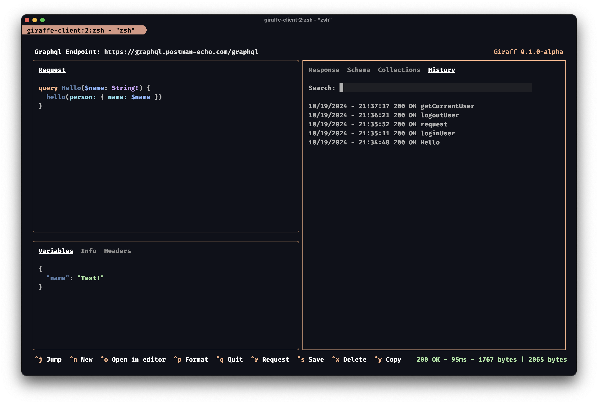

# giraffe

**A terminal based, keyboard driven GraphQL client**

Giraffe is a TUI graphql client. Inspired by mainly by [Posting](https://github.com/darrenburns/posting), but also by
[Postman](https://www.postman.com/) or [Insomnia](https://www.insomnia.rest/). 



Key features include:

- Collections stored locally in JSON files
- Dotfile configuration
- Format query and variables
- GraphQL schema explorer and operation generator
- Jump mode navigation
- Open query, variables, headers, response etc. in $EDITOR
- Syntax highlighting

## Installation

Giraffe can be installed using `npm` and currently has only been tested on MacOS.

```bash
$ npm install --global giraffe
```

## Configuration

Giraffe will look for a configuration file at the following paths in order of precedence:

- `${process.env.HOME}/.config/giraffe/giraffe.json`
- `${process.env.HOME}/.giraffe.json`

The configuration file support the following options:
```jsonc
{
  collections: {
    folderPath: `${process.env.HOME}/.config/giraffe/collections`,
  },
  theme: {
    // User interface colors
    accent: "#FAB387",
    background: "#0F111A",
    error: "#F38BA8",
    info: "#FFFFFF",
    primary: "#5E81AC",
    secondary: "#8FBCBB",
    success: "#A6E3A1",
    warning: "#FAB387",

    boxBorder: "#FAB387",
    keyboardShortcut: "#FAB387",
    keyboardShortcutText: "#FFFFFF",
    tab: "#FFFFFF",
    tabKey: "#FAB387",
    urlLabel: "#FFFFFF",
    urlInputBackground: "#1d2133",

    // Syntax highlighting colors
    attribute: "#5E81AC",
    keyword: "#FAB387",
    kwarg: "#89dceb",
    number: "#89b4fa",
    string: "#A6E3A1",
    type: "#cba6f7",
    variable: "#89b4fa",
  },
}
```
